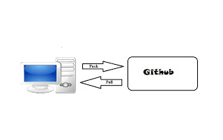

**Tutorial Dasar Github (SSH Key, Membuat Repositori, Pull dan Push menggunakan Gitbash)**

Github adalah sebuah website yang popular di kalangan programmer namun banyak juga yang belum mengetahuinya, github itu sendiri menyediakan tempat untuk penyimpanan atau repository secara cuma-cuma namun juga ada yang berbayar. Dengan menggunakan github pekerjaan membuat sebuah aplikasi atau sebuah projek secara team akan sangat lebih mudah di bandingkan copy paste project dari pc ke pc lain secara manual

**Keterangan:**

1.  $ git init = Menganalisis bahwa direktori terhubung ke git

2.  $ git pull origin master = Untuk menarik data dari repository ke pc

3.  $ git add  = Untuk menambahkan file

4.  $ git status = Untuk mengetahui status dari git

5.  $ git commit -m " Deskrisi" = Untuk menandai terhadapa perubahan

6.  $ git push origin master = Untuk mengunggah data dari Pc ke repository
